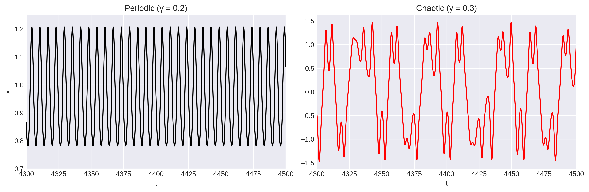
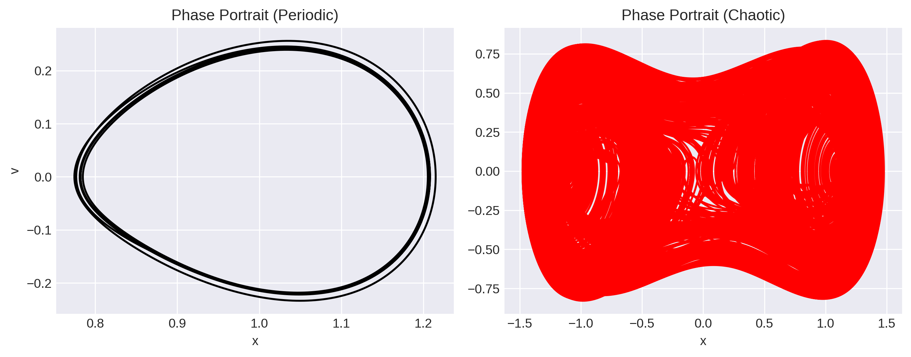
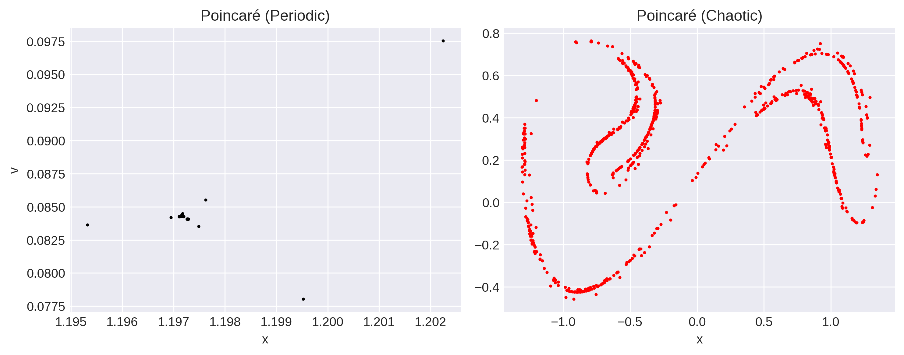
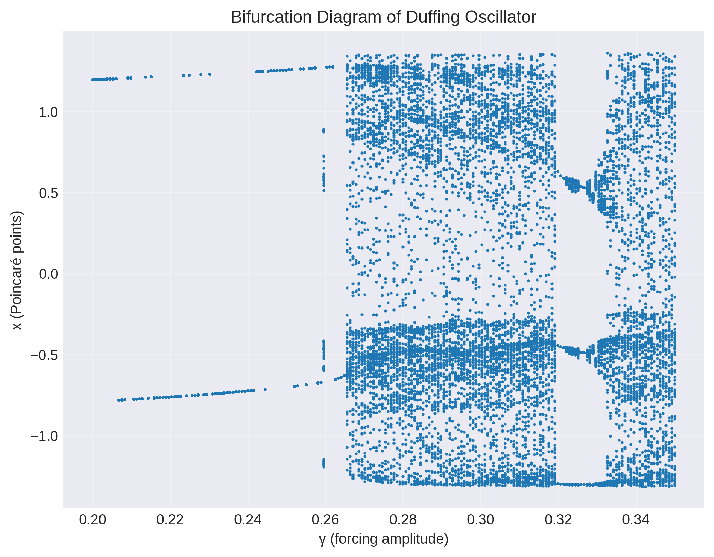

This repository provides a computational exploration of nonlinear dynamics using the Duffing oscillator as a canonical example.
This notebook demonstrates :

- Transition from periodic to chaotic motion
- Effect of forcing amplitude on system dynamics
- Visualization using phase space trajectories

# Duffing Oscillator

The **Duffing oscillator** is a nonlinear, second-order differential equation modeling damped, driven oscillators with cubic stiffness. It is a classical example of a nonlinear system that exhibits both periodic and chaotic behavior depending on the system parameters.  It models the motion of a damped, driven oscillator with a nonlinear restoring force i.e. any system where a restoring force (like a spring) is not perfectly linear, particularly those that exhibit "hardening" or "softening" effects, for eg: steel beams, vehicular suspensions to nonlinear electrical circuits to biological oscillators.

---

## Governing Equation

$\ddot{x} + \delta \dot{x} + \alpha x + \beta x^3 = \gamma \cos(\omega t)$

where:

| Symbol | Meaning | Typical value |
|:-------:|:---------|:---------------|
|  $\delta$  | damping coefficient | 0.2 |
|  $\alpha$  | linear stiffness | -1.0 |
|  $\beta$  | nonlinear stiffness | 1.0 |
|  $\gamma$  | driving amplitude | 0.3 |
|  $\omega$  | driving frequency | 1.2 |

---

## Dynamics

- The system reduces to a **linear harmonic oscillator** when $\beta = 0$.
- For  $\alpha < 0$ and  $\beta > 0$ , the potential has a **double-well** shape.
- Depending on $\gamma$ (the forcing amplitude), the oscillator can show:
  - Periodic motion (small forcing)
  - Period-doubling
  - Chaotic motion (large forcing)

---
## Dynamical Regimes

The Duffing oscillator exhibits qualitatively different behavior depending on the forcing amplitude $\gamma$.

### Periodic regime ($\gamma = 0.2$)

The system oscillates regularly within a single well of the potential.

### Chaotic regime ($\gamma = 0.3$)

The motion becomes aperiodic and explores both wells, leading to a strange attractor in phase space.

### Time evolution comparison :

  

### Phase portrait comparison :

### Poincare section comparison :

  

---
## Interpretation

The transition from periodic to chaotic motion is clearly visible in the Poincaré sections.
While periodic motion results in a small number of discrete points, chaotic motion produces a scattered structure corresponding to a strange attractor. This illustrates the sensitivity of nonlinear systems to parameter variations. The systematic evolution with a control parameter is further illustrated by the bifuraction diagram. Here, we plot the bifuraction diagram with amplitude of external forcing $\gamma$ as the control parameter, using stroboscopic sampling (Poincaré section). This reveals a period-doubling route to chaos.

  

---

## Files in this Folder

| File | Description |
|------|--------------|
| `duffing(1).ipynb` | Basic simulation of the Duffing oscillator, including time series, phase portraits & Poincare section.|
|`transition_periodic_to_chaotic.ipynb`| Demonstrates the transition from periodic to chaotic dynamics, including Time series comparisons, Phase portraits, Poincare sections and Bifurcation diagram |
| `README.md` | Describes the system and how to use the code. |

---

## How to Run

1. Open the notebook in Google Colab
2. Run all cells
3. Modify parameters in the parameter cell:
   - gamma (forcing amplitude)
   - omega (frequency)
4. Generate:
   - time series
   - phase portraits
   - Poincare maps
   - Run bifurcation diagrams for each parameter loop

